# Aplicativo de Tarefas

<!---Esses são exemplos. Veja https://shields.io para outras pessoas ou para personalizar este conjunto de escudos. Você pode querer incluir dependências, status do projeto e informações de licença aqui--->


<p float="left">
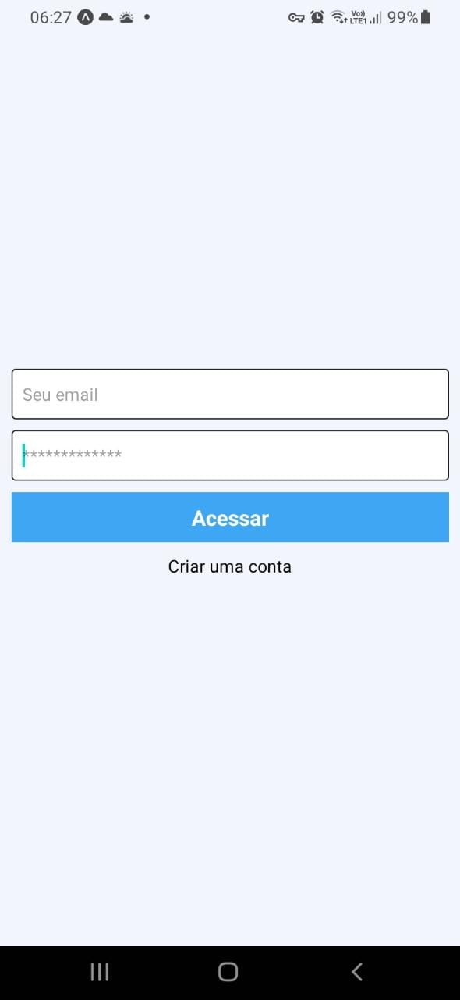
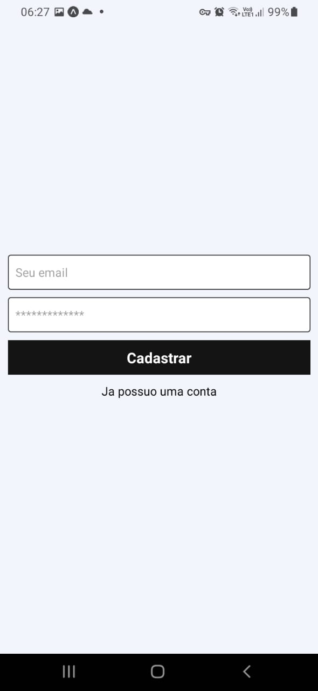
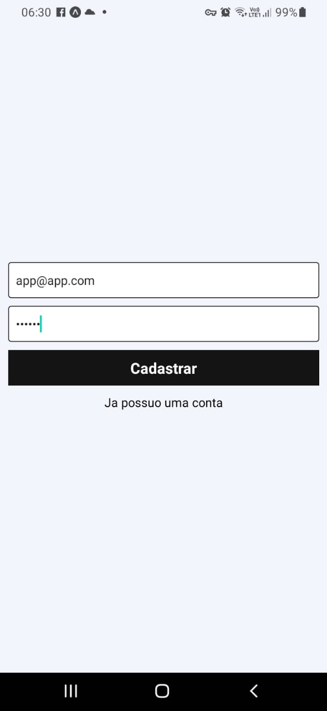
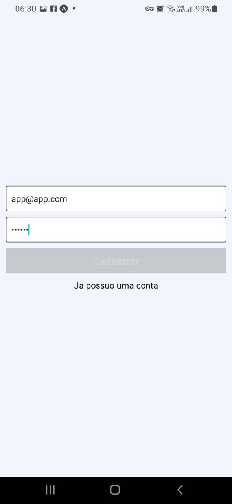
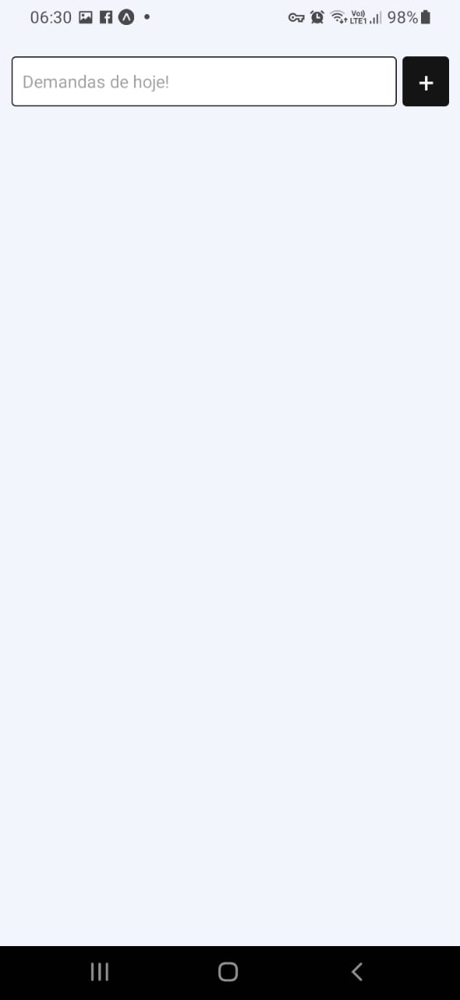
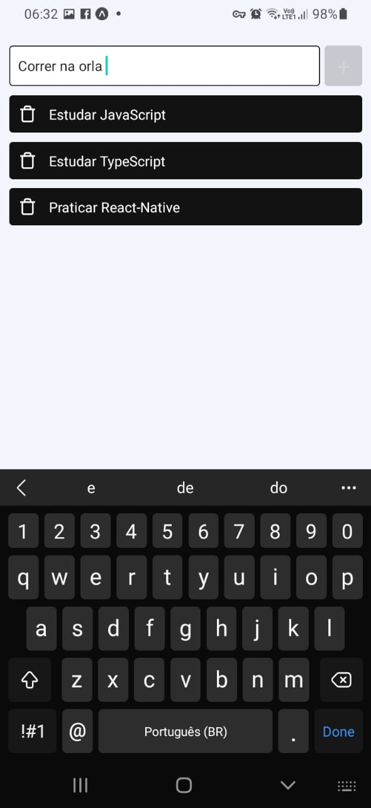
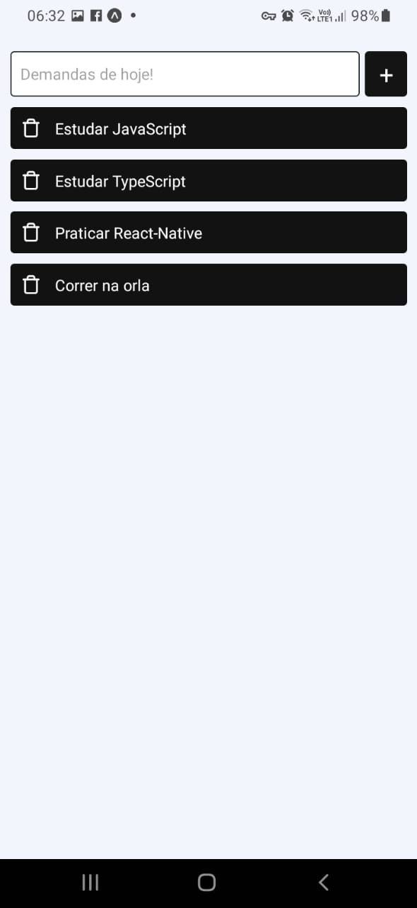
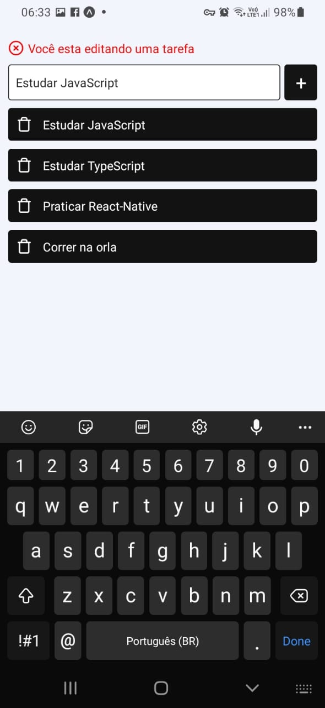
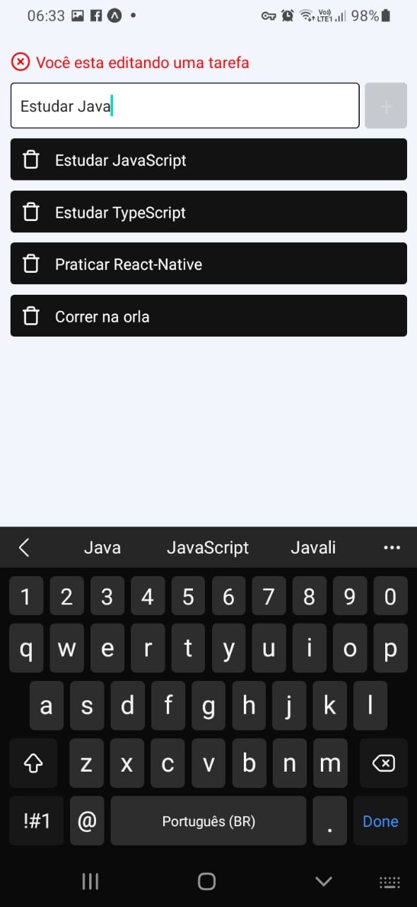
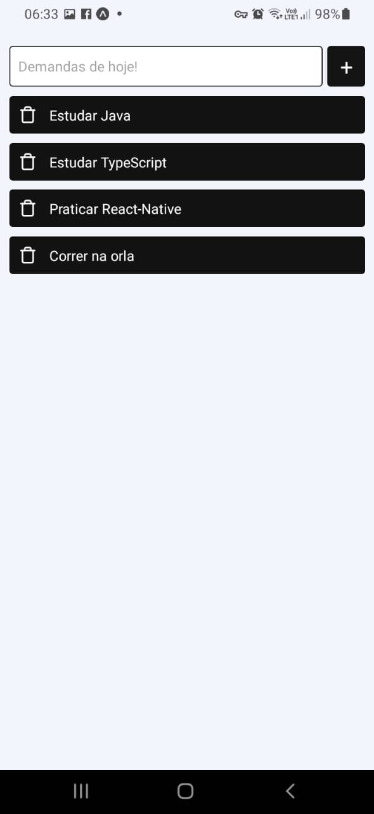
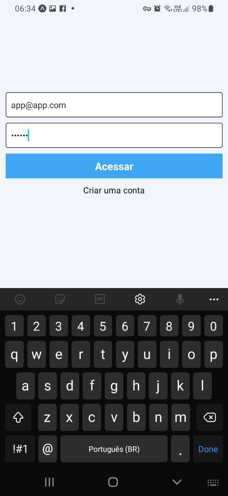
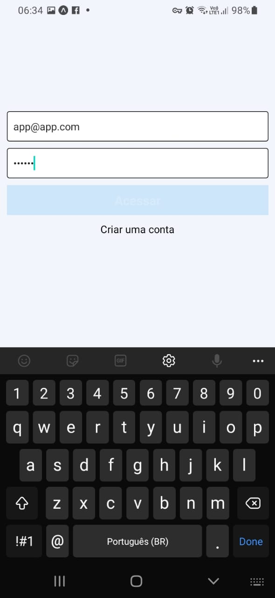
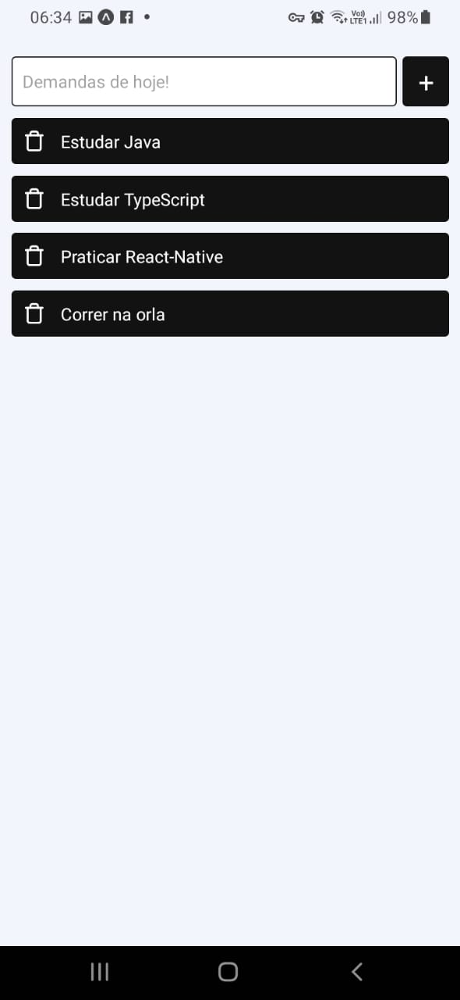
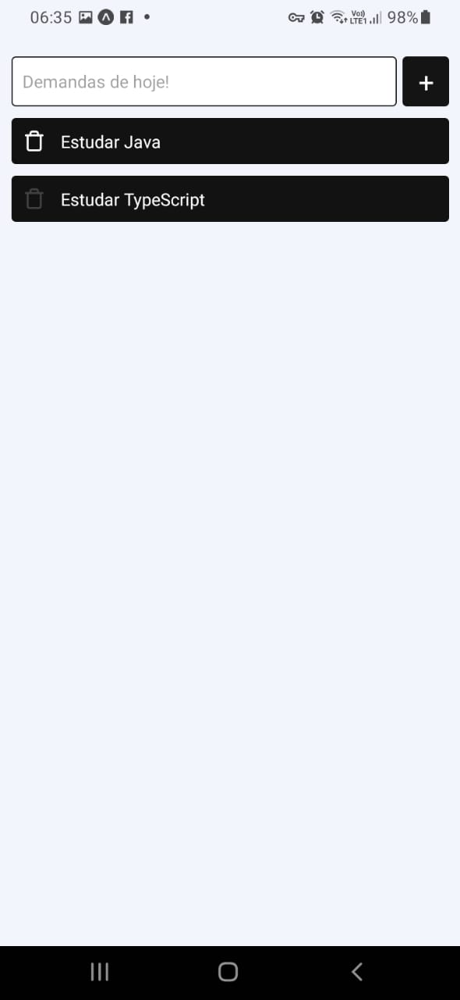
<p/>

> Aplicativo desenvolvido em React-Native ,JavaScript e Expo GO ; ultilizando Authentication e RealtimeDatabase do FIREBASE,
Onde é possivel criar sua conta autenticada ,criar tarefas ,editar e remover.

### Ajustes e melhorias

O projeto ainda está em desenvolvimento e as próximas atualizações serão voltadas nas seguintes tarefas:

- [x] Alinhamento dos Components
- [ ] UI/UX
- [ ] Botão Sair

## 💻 Pré-requisitos
Antes de começar, verifique se você atendeu aos seguintes requisitos:

* Você instalou a versão mais recente de `<Expo Go / React-Native / firebase / Node.js>`
* Compatível com `<Windows / Linux / Mac>`.

## 🚀 Instalando <App_Tarefas>

Para instalar o <App_Tarefas>, siga estas etapas:

Linux, macOS e Windows:
```bash
# Clone este repositório
$ git clone https://github.com/Mateusfpfeitosa/App_Tarefas.git
# Instale as dependências
$ npm install ou yarn
# Execute a aplicação
$ npm start ou yarn run
```

## 📫 Contribuindo para <App_Tarefas>
<!---Se o seu README for longo ou se você tiver algum processo ou etapas específicas que deseja que os contribuidores sigam, considere a criação de um arquivo CONTRIBUTING.md separado--->
Para contribuir com <App_Tarefas>, siga estas etapas:

1. Bifurque este repositório.
2. Crie um branch: `git checkout -b <nome_branch>`.
3. Faça suas alterações e confirme-as: `git commit -m '<mensagem_commit>'`
4. Envie para o branch original: `git push origin <nome_do_projeto> / <local>`
5. Crie a solicitação de pull.

Como alternativa, consulte a documentação do GitHub em [como criar uma solicitação pull](https://help.github.com/en/github/collaborating-with-issues-and-pull-requests/creating-a-pull-request).


[⬆ Voltar ao topo](#App_Tarefas)<br>

